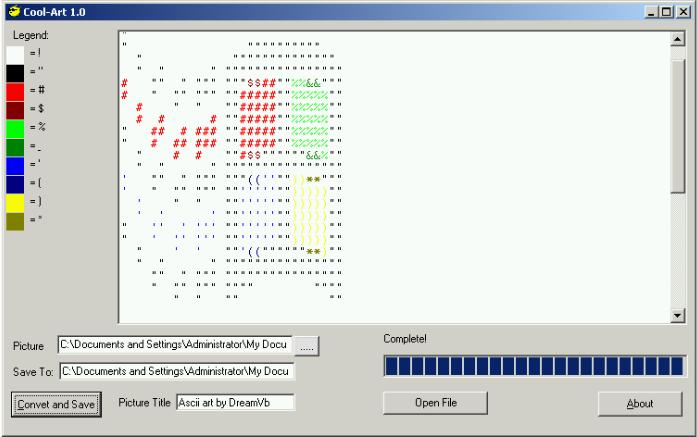



## Picture to Text \(Update to Icon to Text\)

### Description

This code is an update to the Icon to Text converter submitted by Ben Jones. I have posted this with his permission. Please visit his website at:

http://www.codearchive.com/~dreamvb

If you like it, please vote. Anyway, This update adds the following abilities: 

<UL>

<li>Ability to convert any image insertable into a picturebox. I.E. JPG, GIF, BMP, WMF, ICO.</LI>

<li>Large picture support. Will support text files with widths up to 22 inches without word wrapping, larger with word wrapping.</li>

<li>Character support for up to 223 colors</li>

<li>Full-color text display using richtextbox control. (Now saves to rtf, but you can comment out that option)</li>

<li>Color legend to show mappings (Uses dynamic control loading)</li>

</ul>

Requires RichTextbox control for rtf previewing, Windows common controls 6.0 for progressbar.

Produces RTF text picture with color legend. My girlfriend uses this for cross-stitch patterns.

However, Color is limited to 223 colors(character set 33-255) However, I've had great success in converting jpgs to 256 color bitmaps prior to converting to text.

Basically, I have changed Ben's conversion logic to an array of colors with indexes equal to ascii character codes.

 
### More Info
 

             |
---                |---
**Submitted On**   |2001-05-06 10:04:34
**By**             |[Jay Kreusch](https://github.com/Planet-Source-Code/PSCIndex/blob/master/ByAuthor/jay-kreusch.md)
**Level**          |Intermediate
**User Rating**    |4.8 (53 globes from 11 users)
**Compatibility**  |VB 5\.0, VB 6\.0
**Category**       |[Complete Applications](https://github.com/Planet-Source-Code/PSCIndex/blob/master/ByCategory/complete-applications__1-27.md)
**World**          |[Visual Basic](https://github.com/Planet-Source-Code/PSCIndex/blob/master/ByWorld/visual-basic.md)
**Archive File**   |[CODE\_UPLOAD70296232000\.zip](https://github.com/Planet-Source-Code/jay-kreusch-picture-to-text-update-to-icon-to-text__1-9164/archive/master.zip)

